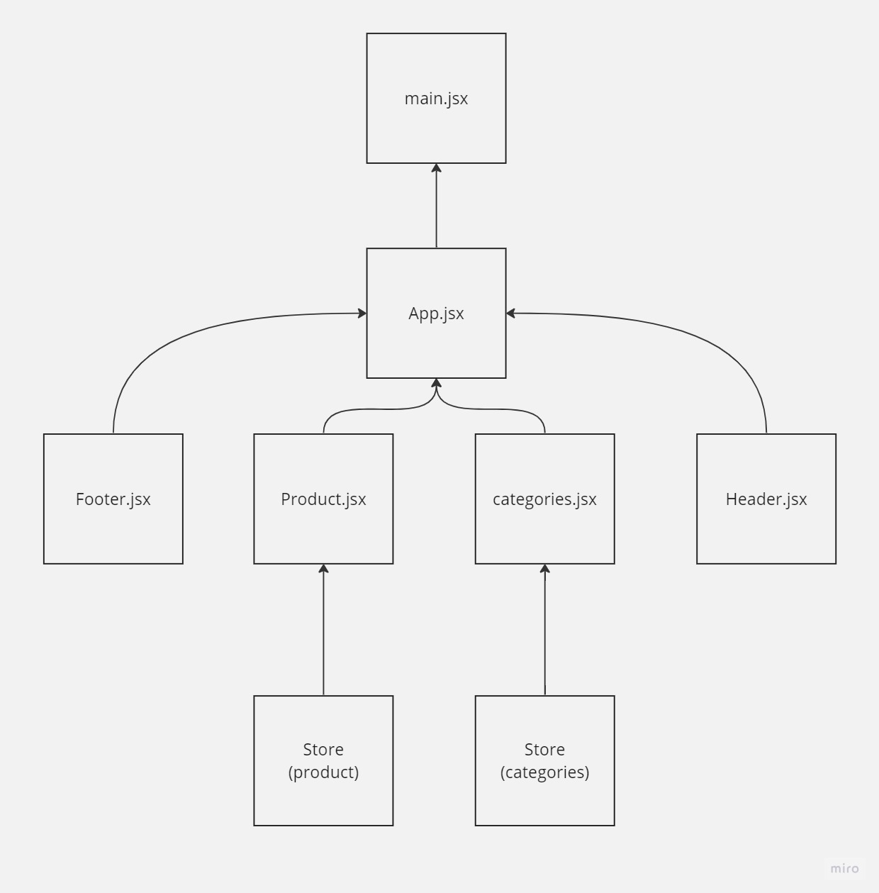
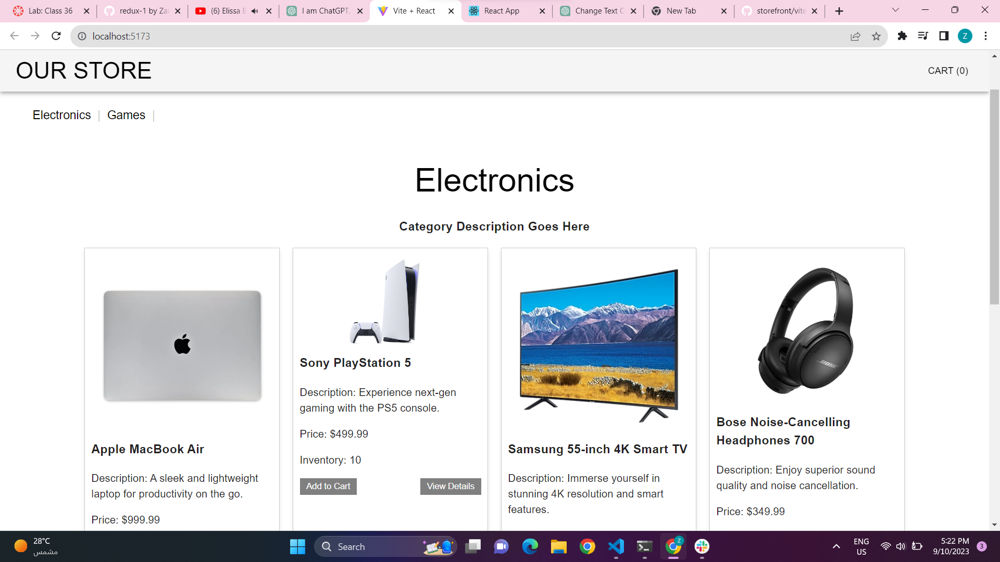
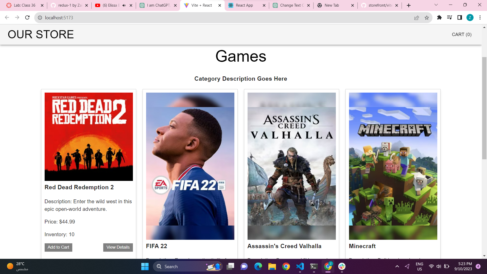
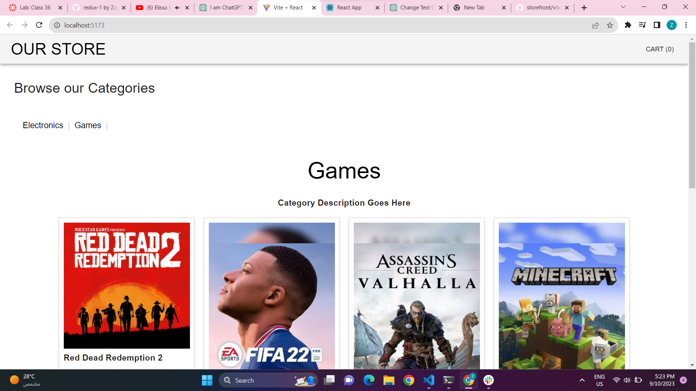

# Virtual Store:

The Virtual Store is a web application created using React, Redux, and Material UI. It emulates the experience of an online store, offering users the ability to explore product categories and view products within those categories.

### UML 

### Key Features

- **Product Categories**: Display a comprehensive list of product categories to guide users in their shopping journey.

- **Category Selection**: Easily select a category of interest to explore its associated products.

- **Product Details**: Access detailed information about each product, helping customers make informed choices.

- **Shopping Cart**: Add desired products to the shopping cart for a seamless shopping experience.

- **Responsive Design**: Ensure a consistent and user-friendly experience across both mobile and desktop devices.

### Technologies Utilized

- **React**: Employed for building dynamic and interactive user interfaces.

- **Redux**: Utilized as a reliable state management solution for maintaining the application's state.

- **Material UI**: Employed to create an aesthetically pleasing and responsive web interface.

### Project Structure

The Virtual Store project comprises the following key components:

- **Header**: Displays the store's name and logo, providing users with a familiar and welcoming entry point.

- **Footer**: Features copyright and contact information, adding a professional touch to the application.

- **Categories**: Lists the available product categories and facilitates easy category selection for users.

- **Products**: Showcases a curated selection of products associated with the chosen category.

- **Redux Store**: Centralizes the management of categories, products, and the shopping cart, ensuring a coherent and reliable application state.

### Getting Started

To begin using the Virtual Store:

1. Clone the repository to your local machine.

2. Install project dependencies by running `npm install`.

3. Start the application with `npm run dev`.

Explore, shop, and enjoy the Virtual Store experience!

